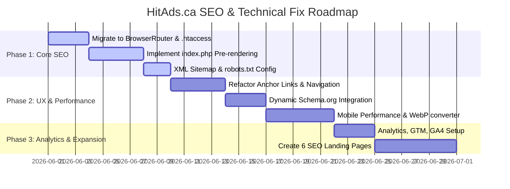

# Product Requirements Document (PRD)
## Project: HitAds.ca — SEO & Technical Development Fixes

| Metadata | Details |
| :--- | :--- |
| **Document Version** | 1.0.0 |
| **Status** | Proposed |
| **Target Platform** | HitAds.ca (Classifieds Marketplace) |
| **Tech Stack Context** | React (Vite SPA) on Frontend, PHP + MySQL (XAMPP/Hostinger/LiteSpeed) on Backend |
| **Author** | AI Solutions Architect |
| **Date** | May 27, 2026 |

---

## 1. Executive Summary

### 1.1 Project Vision
The objective of this project is to transform **HitAds.ca** from a client-side-only React Single Page Application (SPA) with low search engine visibility into an SEO-optimized, highly crawlable, and lightning-fast classifieds platform. This will establish a strong organic foundation to scale marketing campaigns and drive long-term organic user acquisition.

### 1.2 Core Audit Findings
An audit of the existing HitAds.ca implementation highlighted the following critical SEO bottlenecks:
*   **Excessive Client-Side Rendering (CSR):** A rendering percentage of **2205%** means search engine crawlers (Googlebot, Bingbot) and AI/LLM scrapers struggle to index platform content.
*   **Invisible Routing (HashRouter):** The application currently relies on `HashRouter` (`https://hitads.ca/#/item/123`). Search engine crawlers ignore everything after the `#` character, rendering all category pages, listings details, and help pages completely un-crawlable and un-indexable.
*   **Zero Crawlable Links:** Due to client-side button click handlers and hash routes, the crawler sees 0 internal crawlable HTML links on the page.
*   **Missing Crucial SEO Infrastructure:** Missing homepage/page meta descriptions, robots.txt configuration issues, lack of XML sitemaps, missing canonical tags, and no Schema.org structured data.
*   **Underperforming Mobile Core Web Vitals:** A mobile score of **63** with a First Contentful Paint (FCP) of **4.9s** and Largest Contentful Paint (LCP) of **5.0s**.
*   **Missing Tracking Infrastructure:** No analytics platform (GA4/GTM/Pixel) is installed.

---

## 2. Technical Solution Architecture: Hybrid PHP Pre-Rendering

To resolve the client-side rendering (CSR) and HashRouter limitations *without* requiring an expensive hosting migration (e.g. setting up Node.js SSR servers on Hostinger shared hosting), we propose a **Hybrid PHP Pre-rendering** architecture. 

Because HitAds.ca uses a PHP backend alongside a React Vite frontend, we can intercept incoming crawl requests at the server level, fetch metadata from the MySQL database, and inject it directly into the HTML payload before serving it.

```
                  ┌──────────────────────────────────────────┐
                  │          Visitor / Crawl Request         │
                  └────────────────────┬─────────────────────┘
                                       │
                                       ▼
                  ┌──────────────────────────────────────────┐
                  │    LiteSpeed Web Server (.htaccess)      │
                  └────────────────────┬─────────────────────┘
                                       │ (Rewrite to index.php)
                                       ▼
                  ┌──────────────────────────────────────────┐
                  │            index.php Entry               │
                  └────────────────────┬─────────────────────┘
                                       │
                   ┌───────────────────┴───────────────────┐
                   ▼                                       ▼
         [ User Agent: Crawler ]                  [ User Agent: Browser ]
                   │                                       │
      Query Database (MySQL Listings)              Output Default HTML Template
                   │                                       │
      Inject: Title, Meta, OG Tags,                        │
     Schema.org (JSON-LD) into Header                      │
                   │                                       │
                   └───────────────────┬───────────────────┘
                                       │
                                       ▼
                  ┌──────────────────────────────────────────┐
                  │          Return HTML Response            │
                  │     (React mounts & runs in browser)     │
                  └──────────────────────────────────────────┘
```

### 2.1 Route Modernization: HashRouter to BrowserRouter
*   **Action:** Migrate [App.tsx](file:///d:/Nishantha/Market_Hub/App.tsx) from `HashRouter` to `BrowserRouter` (renamed as `Router`).
*   **Impact:** Changes URLs from `https://hitads.ca/#/item/12` to `https://hitads.ca/item/12` which are standard, crawlable paths.
*   **Server Support:** Create a `.htaccess` file in the root directory to route all requests that do not target physical files or directories to our main entry page `index.php`.

```apache
# .htaccess
<IfModule mod_rewrite.c>
  RewriteEngine On
  RewriteBase /
  
  # Redirect /index.html to /index.php if requested directly
  RewriteRule ^index\.html$ /index.php [R=301,L]
  
  # Send all other requests to index.php if they aren't real files or directories
  RewriteCond %{REQUEST_FILENAME} !-f
  RewriteCond %{REQUEST_FILENAME} !-d
  RewriteRule . /index.php [L]
</IfModule>
```

### 2.2 Server-Side Header Injection (`index.php`)
Rename the frontend entry file from `index.html` to `index.php` and implement backend route matching. When a search crawler (or normal user) requests a listing, PHP will pre-populate the HTML header:

```php
<?php
// index.php
require_once 'api/config.php';

$request_uri = $_SERVER['REQUEST_URI'];
$page_title = "HitAds.ca – Toronto Classified Ads & Local Marketplace Canada";
$meta_desc = "HitAds.ca is Canada's modern classified ads platform connecting local communities, businesses, services, jobs, real estate, and marketplace listings across Toronto and beyond.";
$og_image = "https://hitads.ca/assets/logo.png";
$canonical_url = "https://hitads.ca" . explode('?', $request_uri)[0];
$schema_markup = "";

// Match Listing Detail: /item/{id}
if (preg_match('/\/item\/([0-9]+)/', $request_uri, $matches)) {
    $listing_id = intval($matches[1]);
    try {
        $stmt = $conn->prepare("SELECT title, description, price, location, image, created_at FROM listings WHERE id = ?");
        $stmt->execute([$listing_id]);
        $listing = $stmt->fetch();
        
        if ($listing) {
            $page_title = htmlspecialchars($listing['title']) . " for Sale in " . htmlspecialchars($listing['location']) . " | HitAds.ca";
            $meta_desc = htmlspecialchars(substr(strip_tags($listing['description']), 0, 160)) . "...";
            $canonical_url = "https://hitads.ca/item/" . $listing_id;
            
            // Handle image parsing
            $images = json_decode($listing['image'], true);
            if (is_array($images) && count($images) > 0) {
                $og_image = "https://hitads.ca" . $images[0];
            } elseif (!empty($listing['image'])) {
                $og_image = strpos($listing['image'], 'http') === 0 ? $listing['image'] : "https://hitads.ca" . $listing['image'];
            }
            
            // Build Product Schema
            $schema_markup = '
            <script type="application/ld+json">
            {
              "@context": "https://schema.org",
              "@type": "Product",
              "name": ' . json_encode($listing['title']) . ',
              "description": ' . json_encode(substr(strip_tags($listing['description']), 0, 250)) . ',
              "image": ' . json_encode($og_image) . ',
              "offers": {
                "@type": "Offer",
                "price": "' . $listing['price'] . '",
                "priceCurrency": "CAD",
                "availability": "https://schema.org/InStock"
              }
            }
            </script>';
        }
    } catch (Exception $e) {
        // Fallback silently to default tags
    }
}
?>
<!DOCTYPE html>
<html lang="en">
<head>
    <meta charset="utf-8">
    <meta name="viewport" content="width=device-width, initial-scale=1.0">
    <link rel="icon" type="image/png" href="/assets/logo.png" />
    <title><?php echo $page_title; ?></title>
    <meta name="description" content="<?php echo $meta_desc; ?>">
    <link rel="canonical" href="<?php echo $canonical_url; ?>" />
    
    <!-- Open Graph (Facebook / LinkedIn) -->
    <meta property="og:type" content="website">
    <meta property="og:title" content="<?php echo $page_title; ?>">
    <meta property="og:description" content="<?php echo $meta_desc; ?>">
    <meta property="og:url" content="<?php echo $canonical_url; ?>">
    <meta property="og:image" content="<?php echo $og_image; ?>">
    <meta property="og:site_name" content="HitAds.ca">
    
    <!-- Twitter Card -->
    <meta name="twitter:card" content="summary_large_image">
    <meta name="twitter:title" content="<?php echo $page_title; ?>">
    <meta name="twitter:description" content="<?php echo $meta_desc; ?>">
    <meta name="twitter:image" content="<?php echo $og_image; ?>">
    
    <!-- Inline Schema.org Markup -->
    <?php echo $schema_markup; ?>
    
    <!-- Tailwind and Styles -->
    <script src="https://cdn.tailwindcss.com?plugins=forms,container-queries"></script>
    <link href="https://fonts.googleapis.com/css2?family=Inter:wght@300;400;500;600;700;800;900&display=swap" rel="stylesheet">
    <link href="https://fonts.googleapis.com/icon?family=Material+Icons" rel="stylesheet">
    <script>
        tailwind.config = {
            darkMode: "class",
            theme: {
                extend: {
                    colors: {
                        "primary": "#2558a7",
                        "primary-hover": "#1d4a8f",
                        "primary-light": "#3b82f6",
                        "primary-soft": "#60a5fa",
                        "primary-neutral": "#94a3b8",
                        "secondary": "#cc2d2d",
                        "secondary-hover": "#a82222",
                        "accent": "#cc2d2d",
                        "background-light": "#f8fafc",
                        "background-dark": "#1a1a1a",
                    },
                    fontFamily: {
                        "display": ["Inter", "sans-serif"]
                    }
                },
            },
        }
    </script>
    <style>
        body { font-family: 'Inter', sans-serif; }
        .scrollbar-hide::-webkit-scrollbar { display: none; }
        .scrollbar-hide { -ms-overflow-style: none; scrollbar-width: none; }
    </style>
</head>
<body class="bg-background-light text-slate-900 transition-colors duration-200">
    <div id="root"></div>
    <script type="module" src="/index.tsx"></script>
</body>
</html>
```

---

## 3. Detailed Product Requirements

### 3.1 Metadata & Tag Management
*   **FR-1.1 [Dynamic Title & Description]:** Every page path must resolve to a unique `<title>` and `<meta name="description">` that satisfies target keyword densities.
*   **FR-1.2 [Canonical URLs]:** All page outputs must declare a canonical link pointing to the primary URL format (without query variables like search filters or tracking hashes, unless relevant).
*   **FR-1.3 [Open Graph & Twitter Cards]:** Generate optimized Facebook OG tags and Twitter Card tags.

#### Meta Tag Template Map:
| Page Route | Title Tag Pattern | Meta Description |
| :--- | :--- | :--- |
| **Homepage** (`/`) | HitAds.ca – Toronto Classified Ads & Local Marketplace Canada | HitAds.ca is Canada's modern classified ads platform connecting local communities, businesses, services, jobs, real estate, and marketplace listings across Toronto and beyond. |
| **Category** (`/search?category=...`) | Buy & Sell [Category Name] in Toronto \| HitAds.ca | Find deals on [Category Name] in Toronto and surrounding GTA. Browse listings, post classified ads for free, and connect with local buyers and sellers. |
| **Listing Details** (`/item/:id`) | [Item Title] for Sale in [Location] \| HitAds.ca | Buy [Item Title] in [Location] for $[Price]. Check pictures, description, seller info, and contact details on HitAds.ca. |
| **SEO Landing Page** (`/toronto-classifieds`) | Toronto Classifieds & Local Marketplace - Buy & Sell \| HitAds.ca | Search local classifieds listings in Toronto, ON. Post free advertisements for jobs, cars, real estate, and items for sale on HitAds.ca. |

---

### 3.2 Dynamic XML Sitemaps Implementation
*   **FR-2.1 [Sitemap Index File]:** Expose a central XML sitemap index at `https://hitads.ca/sitemap.xml` which references sub-sitemaps.
*   **FR-2.2 [Automatic Listing Inclusion]:** A dynamic PHP sitemap generation script must run automatically at `https://hitads.ca/sitemap-listings.xml`. When a new ad is posted, it is instantly included in the sitemap.
*   **FR-2.3 [Structured Sub-Sitemaps]:** Implement the following sitemaps:
    *   `/sitemap-main.xml`: Core static routes (`/`, `/help`, `/contact`, `/terms`, `/buying-guides`, `/safety-tips`, `/selling-advice`, `/market-trends`).
    *   `/sitemap-categories.xml`: Dynamic list of all listing categories.
    *   `/sitemap-listings.xml`: Paginated/dynamic list of all active database listings.

#### Technical Implementation (`api/sitemap_index.php` rewrite map):
In `.htaccess`, rewrite `/sitemap.xml` requests to backend scripts that serve standard `text/xml` formatted outputs:

```apache
RewriteRule ^sitemap\.xml$ api/sitemap_index.php [L]
RewriteRule ^sitemap-main\.xml$ api/sitemap_main.php [L]
RewriteRule ^sitemap-categories\.xml$ api/sitemap_categories.php [L]
RewriteRule ^sitemap-listings\.xml$ api/sitemap_listings.php [L]
```

#### Code Snippet - Dynamic Listing Sitemap (`api/sitemap_listings.php`):
```php
<?php
header("Content-Type: application/xml; charset=utf-8");
require_once 'config.php';

echo '<?xml version="1.0" encoding="UTF-8"?>';
echo '<urlset xmlns="http://www.sitemaps.org/schemas/sitemap/0.9">';

try {
    // Select active ads, order by most recent
    $stmt = $conn->query("SELECT id, created_at FROM listings ORDER BY created_at DESC LIMIT 10000");
    while ($row = $stmt->fetch()) {
        $lastmod = date('c', strtotime($row['created_at']));
        echo '<url>';
        echo '  <loc>https://hitads.ca/item/' . $row['id'] . '</loc>';
        echo '  <lastmod>' . $lastmod . '</lastmod>';
        echo '  <changefreq>weekly</changefreq>';
        echo '  <priority>0.8</priority>';
        echo '</url>';
    }
} catch (Exception $e) {
    // Silently log or output minimum
}

echo '</urlset>';
?>
```

---

### 3.3 robots.txt Validation
*   **FR-3.1 [Validation Rules]:** Maintain a clean `robots.txt` in the root workspace directory.
*   **Target Configuration:**
```text
User-agent: *
Allow: /

# Block admin and user account configuration directories
Disallow: /dashboard/
Disallow: /admin/
Disallow: /profile/
Disallow: /api/admin/
Disallow: /api/auth/

Sitemap: https://hitads.ca/sitemap.xml
```

---

### 3.4 Structured Data (Schema.org) Specifications
Implement Schema.org JSON-LD structured snippets dynamically in `index.php` headers to achieve rich-snippet indicators (stars, prices, locations) on search engine results:

#### 1. Organization Schema (Homepage)
```json
{
  "@context": "https://schema.org",
  "@type": "Organization",
  "name": "HitAds.ca",
  "url": "https://hitads.ca",
  "logo": "https://hitads.ca/assets/logo.png",
  "sameAs": [
    "https://www.facebook.com/hitads.ca",
    "https://www.instagram.com/hitads.ca",
    "https://www.linkedin.com/company/hitads"
  ]
}
```

#### 2. LocalBusiness Schema (Homepage / Local Pages)
```json
{
  "@context": "https://schema.org",
  "@type": "LocalBusiness",
  "name": "HitAds.ca",
  "image": "https://hitads.ca/assets/logo.png",
  "url": "https://hitads.ca",
  "telephone": "+1-800-555-0199",
  "address": {
    "@type": "PostalAddress",
    "addressLocality": "Toronto",
    "addressRegion": "ON",
    "addressCountry": "CA"
  }
}
```

#### 3. Product & Offer Schema (Dynamic Listings Details)
Mapped values dynamically populated from the database values in `index.php` for `listings` table columns:
```json
{
  "@context": "https://schema.org",
  "@type": "Product",
  "name": "{listings.title}",
  "description": "{listings.description}",
  "image": "https://hitads.ca{listings.image}",
  "offers": {
    "@type": "Offer",
    "price": "{listings.price}",
    "priceCurrency": "CAD",
    "availability": "https://schema.org/InStock",
    "url": "https://hitads.ca/item/{listings.id}",
    "priceValidUntil": "{one year from listing date}"
  }
}
```

---

### 3.5 Internal Linking & Anchor Tag Refactoring
*   **FR-4.1 [Semantic Navigation]:** Search engine crawlers do not register clicks on javascript click handlers. All clickable routing cards (category navigation, grid items, header, and footer menus) must be refactored to render as native HTML `<a>` tags.
*   **Action Plan:**
    *   Change `<div onClick={() => navigate('/search')}>` to `<Link to="/search" className="...">`.
    *   Ensure Vite React Router `Link` components output standard `<a href="/search">` tags.

---

### 3.6 SEO Landing Pages & Content Expansion
To capture high-intent local marketplace search terms, the platform will implement static landing pages with dynamic listing aggregates.

*   **FR-5.1 [Dedicated Landing Routes]:** Implement dedicated, clean client-side routes for the following target keywords:
    *   `/toronto-classifieds` (Toronto Classified Ads)
    *   `/buy-and-sell-toronto` (Buy and Sell Toronto)
    *   `/local-services-toronto` (Local Services Toronto)
    *   `/jobs-toronto` (Jobs Toronto)
    *   `/real-estate-toronto` (Real Estate Toronto)
    *   `/sri-lankan-marketplace-canada` (Sri Lankan Marketplace Canada)
*   **FR-5.2 [Page Structure & Copy]:** Each landing page must feature 800–1,200 words of crawlable, optimized copy containing localized headers. This includes:
    *   An `<h1>` header focusing on target keywords.
    *   **About the platform** in that category/region.
    *   **How the marketplace works** for local users.
    *   **Featured categories** links.
    *   **Local benefits** and safety recommendations.
    *   An aggregate grid component showing the latest listings matching the page criteria (e.g. latest cars or jobs).

---

### 3.7 Mobile Performance & Core Web Vitals Optimization
Targeting a mobile score improvement from **63 to 85+** and LCP reduction to **< 2.5s**:

*   **FR-6.1 [Image Optimization]:**
    *   Apply `loading="lazy"` to all listing images on homepages and grid components.
    *   Convert raw user-uploaded file formats (JPEGs, PNGs) into modern **WebP** files on listing creation. Resize images to a maximum width of 1200px.
*   **FR-6.2 [Reduce Unused JS & Payloads]:**
    *   Configure Vite's build settings to code-split routes (lazy loading pages).
    *   Move custom icon sets or scripts to SVG format directly instead of bloating external fonts.
*   **FR-6.3 [Browser Caching & Asset Delivery]:**
    *   Enable LiteSpeed Cache rules or `.htaccess` browser caching configurations to specify expiration headers for static images, JS, CSS.

---

### 3.8 Analytics & Tracking Integration
Install standard analytics scripts to track user funnel conversions:

*   **FR-7.1 [Google Tag Manager & GA4]:** Integrate GTM script into `index.php`. Implement Google Analytics 4 configuration tag.
*   **FR-7.2 [Meta Pixel & Conversion API]:** Hook up conversion tracking scripts.
*   **FR-7.3 [Custom Analytics Events]:** Trigger key custom events to monitor engagement metrics:

| Event Name | Trigger Condition | Parameter Details |
| :--- | :--- | :--- |
| `user_registration` | Successful registration API response | `method` (e.g. Email/Google) |
| `listing_submission` | Successful creation of an advertisement | `category`, `price`, `location` |
| `search_action` | Search submission from header bar | `search_term`, `category_selected` |
| `contact_click` | Clicking "Reveal Phone" or "Email Poster" | `item_id`, `seller_id` |
| `category_navigation` | Clicking category icons | `category_name` |

---

## 4. Infrastructure & Hosting Enhancements

*   **Cloudflare CDN Integration:** Route DNS records through Cloudflare to leverage edge delivery caching, automatic image resizing, HTML/CSS minification, and protection against malicious bots.
*   **LiteSpeed Server Configuration:** Configure LiteSpeed server caching rules in `.htaccess` to reduce database querying times for non-authenticated crawler requests.

---

## 5. Implementation & Priority Timeline



### Phase 1: Immediate Priorities (Duration: 9 Days)
1. Rewrite routing layout from `HashRouter` to `BrowserRouter`.
2. Configure `.htaccess` route proxy maps.
3. Replace entry `index.html` with `index.php` parsing.
4. Setup dynamic sitemaps and configure robots.txt limits.

### Phase 2: Secondary Priorities (Duration: 12 Days)
5. Structured data integration (Organization, LocalBusiness, Product).
6. Convert internal React navigation triggers to standard HTML elements.
7. Optimize Mobile performance: image lazy-loading, WebP converters, and asset caching rules.

### Phase 3: Expansion & Tracking (Duration: 9 Days)
8. Integrate tracking snippets (GA4, GTM, Pixel) and set up event logs.
9. Construct target SEO landing pages with 800-1200 words of crawlable copy.
10. Final indexing tests using Google Search Console URL Inspection.

---

## 6. QA & Verification Checklist

- [ ] **URL Structure Audit:** Confirm that URLs do not contain hash tags (`/#/`). Ensure `/item/1` loads correctly on page reload.
- [ ] **Crawler Simulation:** Emulate Googlebot using `curl -A "Googlebot" https://hitads.ca/item/1` and verify that meta description, canonical link, and dynamic Schema tags are loaded in the raw HTTP response headers.
- [ ] **Sitemap Validation:** Check `https://hitads.ca/sitemap.xml` with an XML Sitemap validator tool. Confirm it contains updated listings URLs.
- [ ] **Structured Data Testing:** Run active listing URLs through the [Google Rich Results Test](https://search.google.com/test/rich-results) to guarantee Product / Offer schema triggers without warnings.
- [ ] **PageSpeed Benchmark:** Verify mobile Performance scores on Google PageSpeed Insights. Check if FCP is under 2.0s and LCP is under 2.5s.
- [ ] **Analytics Verification:** Verify real-time event logs in GA4 debug mode when clicking navigation options, registering a user, or posting an ad.
